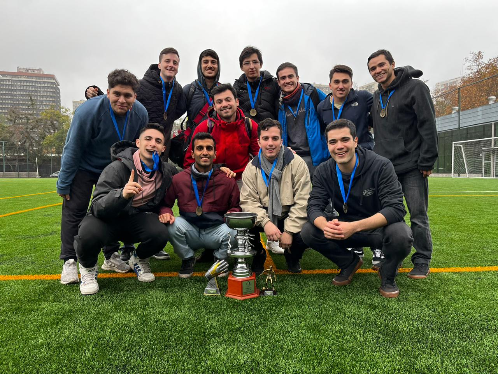

This post is totally unrelated to academia or my professional career. I would like to take some time and share with whoever is reading this some pictures I enjoy to watch time to time and some of my (other from research 😅) passions. I hope I can keep on filling this post with new stuff.

I love playing sports. Throughout high school, I was mainly devoted to volleyball. I had the fortune of playing lots of tournaments in different cities and countries near my hometown. Below are some picture that capture these great moments.

  <figure style="width: 25%;">
    
  </figure>

  <figure style="width: 25%;">
    
  </figure>

  <figure style="width: 50%;">
    
  </figure>

I also enjoy soccer. I have played it (for fun, never at a high level) since I was a little boy.

  

    
  

  

    
  

  

    
  

In the past few years I have learned to enjoy the nature. I definitely do not consider my self a good photographer, but I enjoy taking pictures of nature. Here are some pictures that I have taken of some special places for me and some pictures I enjoy looking. I hope you can enjoy them as much as I do.

  <figure style="width: 100%;">
    
  </figure>
  <figure style="width: 100%;">
    
  </figure>

  <figure style="width: 33%;">
    
  </figure>

  <figure style="width: 33%;">
    
  </figure>

  <figure style="width: 33%;">
    
  </figure>

  <figure style="width: 33%;">
    
  </figure>

  <figure style="width: 33%;">
    
  </figure>

  <figure style="width: 33%;">
    
  </figure>

